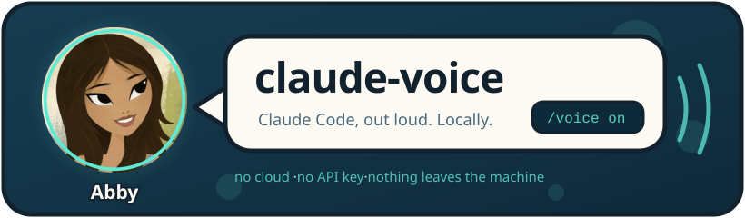
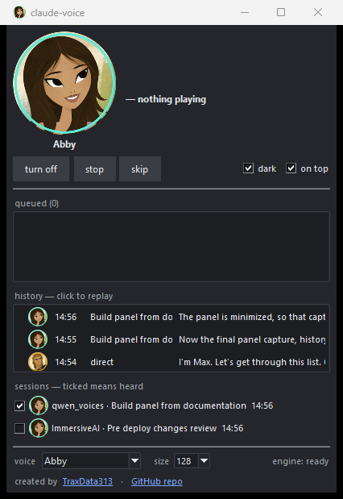

<p align="center">
  
</p>

<p align="center">
  <em>Your terminal grew a voice. It runs on your own machine and tells nobody about it.</em>
</p>

<p align="center">
  <a href="https://traxdata313.github.io/claude-voice/"><strong>▶&nbsp; Demo — hear the voices</strong></a>
  <br>
  <sub>Abby and Max, 5 seconds each</sub>
</p>

<p align="center">
  <a href="https://traxdata313.github.io/claude-voice/" title="Hear her speak">
    
  </a>
</p>

<p align="center">
  <em><strong>Abby</strong>, as claude-voice — click her to hear her speak.</em>
  <br>
  <sub> English and
   Russian are tested and both sound right —
  and 🌐 most widely used languages should read normally.</sub>
</p>

---

**Abby narrates Claude Code's answers** through a local Qwen-TTS model. Your machine only —
totally free: no cloud, no API key, no account, no audio ever leaving the computer. Unplug
the network and she carries on talking.

She speaks the short lines *while* it works, and reads a long answer as its `## TL;DR`
rather than in full — and the installer teaches Claude to write one.
**[How she decides what to say →](docs/writing-for-the-ear.md)**

## Easy install

Windows only. Paste this into Claude Code:

```
Clone https://github.com/TraxData313/claude-voice here, then follow docs/tour.md
in it: set it up, turn it on, and give me the spoken tour.
```

That is the whole of it. Claude fetches Python if you lack it, then the engine and its
model, installs, opens the panel and switches it on — then tells you *out loud* how to
drive it. Ten minutes, nearly all of it download.

**No administrator rights anywhere**, so it goes on a locked-down work laptop as easily as
your own. **[By hand, other builds, every-project install →](docs/install.md)**

## Usage cheatsheet

`/voice <thing>` in Claude Code, or `python voice_cli.py <thing>` in a terminal — the same
tool either way. Mind the space: `/voice on`, never `/voice_on`.

| | |
|---|---|
| `on` / `off` | the switch. `off` leaves the engine warm, so `on` is instant |
| `set abby` | change voice. Any unambiguous substring: `set ab` works |
| `repeat` | say the last answer again. `repeat-all` for the whole thing |
| `stop` | cut off what is playing. The voice stays on (`break` works too) |
| `volume 40` | how loud, 0 to 100 — audible mid-sentence |
| `list` | every voice available |
| `panel` | the window below |
| `update` | is there a newer claude-voice? It only ever looks when you ask |
| `help` | every command, grouped |

**[Full command list →](docs/commands.md)** — generated from the tool itself, so it cannot
go stale.

### The panel

<p align="center">
  
</p>

**`/voice panel`**, or the **Abby for Claude** icon the installer leaves on your Desktop —
no terminal needed. It floats on top, owns nothing, and asks the engine what is happening
twice a second:

- **who is speaking**, what they are saying, and which project it came from — click the
  portrait to swap voice
- **turn off · skip line · skip all**, and a **volume** slider that bites mid-sentence
- **history — click any line to hear it again**, from the audio you already heard
- **a tick per session** — untick one and it stops being read aloud
- voice, portrait size, **dark**, **on top**, and Abby herself along the bottom

## The voices

Two ship with it, both the author's own — original characters, borrowed from nobody:

| | | |
|---|---|---|
|  | **Abby** | Cute, slightly nerdy, young and warm. Calm, never in a hurry — for careful work, tricky debugging, and being talked through something gently. |
|  | **Max** | Brave and driving, a trainer's energy. Punchy lines, counts off what is done, pushes for one more — for grinding through a long list. |

▶ **[Hear them both](https://traxdata313.github.io/claude-voice/)** — GitHub will not play
audio inside a README, so the samples live on a page of their own.

> *With thanks to **Genndy Tartakovsky**, whose* Samurai Jack *is why they look the way they
> do. The characters are ours; the debt is to the style, and to the spirit of the thing.*

**[Cloning your own, and whose voice you may publish →](docs/voices.md)** — a speaker
embedding is a clone of a real person, so that folder has rules.

### Languages

| | |
|---|---|
|  **English** | tested — both voices were cloned from it |
|  **Russian** | tested — Abby reads it genuinely well |
|  **Bulgarian** | reads, but in a **Russian accent** |
| 🌐 **most others** | should read normally — untested, so try one |

**[What to expect, and what is still unwalked →](docs/languages.md)**

## Where the detail lives

| | |
|---|---|
| **[Install →](docs/install.md)** | doing it by hand, builds, options, and why no admin rights are needed |
| **[Setup and tour →](docs/tour.md)** | what Claude follows when you ask it to set this up for you |
| **[Commands →](docs/commands.md)** | all of them, grouped |
| **[Updating →](docs/updating.md)** | getting a newer one, and exactly what the version check does and does not send |
| **[The panel →](docs/panel-plan.md)** | how the window was built, and what changed on the way |
| **[How it works →](docs/how-it-works.md)** | the engine, the watcher, the JNI bridge — and the things that cost real time to find |
| **[Writing for the ear →](docs/writing-for-the-ear.md)** | the TL;DR contract, and why captions sound wrong aloud |
| **[Languages →](docs/languages.md)** | what is tested, and how it fails when it fails |
| **[Voices →](docs/voices.md)** | what may go in that folder, and what may not |
| **[When it goes quiet →](docs/troubleshooting.md)** | silence has no error message. Start here |

<!-- ─────────────────────────────────────────────────────────────────────────
     AUTHOR'S SECTION — copied verbatim from github.com/TraxData313/ImmersiveAI
     Hands off. Only TraxData313 changes the wording below.
     ───────────────────────────────────────────────────────────────────────── -->

## Freely given

- **Public domain** — no license, no strings, no permission to ask ([The Unlicense](LICENSE)).
  Use it, share it, change it, sell it. *"Freely you have received; freely give."* (The bundled
  Harmony library keeps its own MIT notice in `lib\`.)
- **Want to help?** Give feedback and report bugs.
- **No donations** — this is a hobby, done for fun and out of good will; I want to keep money
  out of it. *"For the love of money is the root of all evil."*
- If you still insist on thanking me somehow — visit [my GitHub acc](https://github.com/TraxData313) and read my top pinned

<!-- ── end author's section ── -->
